# Building a Portable Hacking Mini-Computer 
***by Jood M. MAR.18.21***

In this project I'll be using Raspberry Pi and Kali Linux to build a powerful, portable hacking mini-computer that I can use for a lot of hacking reasons. By following this project, you will create a hacking machine that you can potentially use to hack into any smart device or network. However, use your powers responsibly or at the very least have permission to access – for example, if a friend or a colleague asks you to security test their network.

---
## Table of Content
 
  - [Hardware Requirements](#hardware-requirements)
  - [Software Specifications](#software-specifications)
  - [Setup The Mini-computer](#setup-the-mini-computer)
  - [Setup Operating System](#setup-operating-system)
  - [Plug Everything In and Power On](#plug-everything-in-and-power-on)
  - [Finally](#finally)
  - [Conclusion](#conclusion)
  - [Take This Project Further](#take-this-project-further)
---
## Hardware Requirements 
- NEEGO Raspberry Pi 4 4GB Complete Kit, witch has almost everything we need including, (raspberry pi 4 4GB mother board, NEEGO  7" Touchscreen, portable mini Wireless Keyboard with Touchpad Mouse, 6ft HDMI cable, 5v Power supply adapter, 4x Heatsinks and screen case ) you can find it [here](https://www.amazon.com/NEEGO-Raspberry-Complete-Touchscreen-Keyboard/dp/B08245LC71/ref=sr_1_3?crid=19ZBD9GONY0XA&dchild=1&keywords=rasberry+pi+4%2B+with+touchscreen+kit&qid=1621276031&sprefix=rasberry+pi+4%2B+with+%2Caps%2C243&sr=8-3)
- 128GB Sandisk Micro SDXC Extreme Pro and microSD card USB Adapter if your computer does not have an SD reader. (I'll use this SD card since i want a fast and high preformance computer. this sd card is fast and reliable more than the normal sd cards). you can find it [here](https://www.amazon.com/Sandisk-Extreme-Samsung-Everything-Stromboli/dp/B072W6GLLT/ref=sr_1_5?crid=2JBMN1XHO54PI&dchild=1&keywords=micro+sd+card+extreme+pro+128gb&qid=1621277016&sprefix=micro+sd+card+extre%2Caps%2C186&sr=8-5)
- A Desktop computer with  network (to perform the initial installation)
- A power bank (ill use jiga 30000mAH 3amp power bank because it give more than  enough power and it will last for more than 2 days without charging. it's amazing with the computer we are building ). you can find it [here](https://www.amazon.com/JIGA-30000mAh-Portable-Flashlight-Compatible/dp/B08LKDCFZN/ref=sr_1_1_sspa?dchild=1&keywords=power+bank+3+amp&qid=1621279129&sr=8-1-spons&psc=1&smid=A1A4T5YJXYSNTT&spLa=ZW5jcnlwdGVkUXVhbGlmaWVyPUExMUdNUUtSME44NVlGJmVuY3J5cHRlZElkPUEwODY3MDgwMzRGWERZMERNNFdRNCZlbmNyeXB0ZWRBZElkPUEwNTkxMzY2VUk5T1FBN0gxT0kzJndpZGdldE5hbWU9c3BfYXRmJmFjdGlvbj1jbGlja1JlZGlyZWN0JmRvTm90TG9nQ2xpY2s9dHJ1ZQ==)
- A screwdriver to setup the raspberry pi with the screen and the case.
- A usb type C cable (so we can connect the battery to the raspberry pi). you can find it [here](https://www.amazon.com/JSAUX-Charger-Braided-Compatible-Samsung/dp/B086DPMFLL/ref=sr_1_2_sspa?dchild=1&keywords=usb%2Bc&qid=1621279932&sr=8-2-spons&spLa=ZW5jcnlwdGVkUXVhbGlmaWVyPUFERE5DVlBSOFFIQkMmZW5jcnlwdGVkSWQ9QTA1MjA4OTMxTElSNVhCOEdUVDJVJmVuY3J5cHRlZEFkSWQ9QTAwOTk2NTIySzdMWlZOS05PM1NUJndpZGdldE5hbWU9c3BfYXRmJmFjdGlvbj1jbGlja1JlZGlyZWN0JmRvTm90TG9nQ2xpY2s9dHJ1ZQ&th=1)
- A Micro USB cable (to power the screen)you can find it [here](https://www.amazon.com/Charger-CABEPOW-Braided-Charging-Motorola/dp/B07PFZDQP6/ref=sr_1_1_sspa?crid=1EN86XD1CC58C&dchild=1&keywords=usb+micro+cable+1ft&qid=1621286953&sprefix=usb+micro+cable+%2Caps%2C163&sr=8-1-spons&psc=1&spLa=ZW5jcnlwdGVkUXVhbGlmaWVyPUEzRThMUlZGSkVXTzhIJmVuY3J5cHRlZElkPUEwNzE4NDcwMVcwTDdNODBTVjZJQiZlbmNyeXB0ZWRBZElkPUEwMDAzMDM0RDcwV084SE1IMVRPJndpZGdldE5hbWU9c3BfYXRmJmFjdGlvbj1jbGlja1JlZGlyZWN0JmRvTm90TG9nQ2xpY2s9dHJ1ZQ==)

---

## Software Specifications
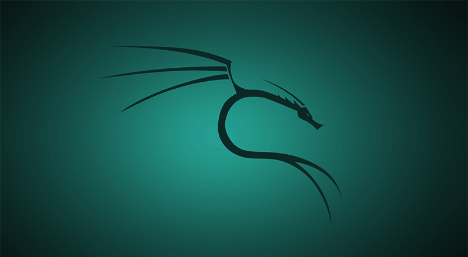
Kali Linux is a Debian-based Linux distribution. It was developed by Mati Aharoni and Deavon Kearns. kali is a meticulously crafted OS that specifically caters to the penetration testers and network analysts. It also contains several hundred tools which are geared towards various information security tasks and it's pre-installed with Kali so you don't need to worry about it that much.

---

## Setup The Mini-computer 

In this step we are preparing the kit to set it up.

1. turn the screen so the back side is up. You will see that there is a mother board that is located in the middle back of the screen and in the top of it there is four screws. these screws is to hold the raspberry pi mother board. So first thing, tie up the raspberry pi to the top of the screen mother board by the screws that you found in the box using the screwdriver.
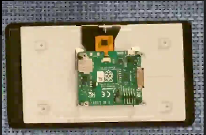
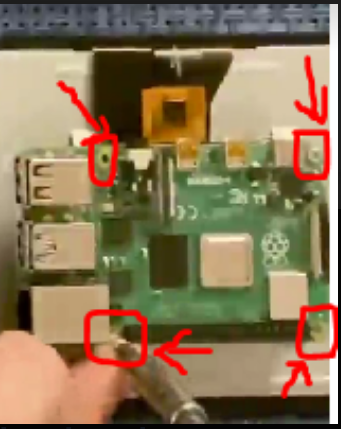

1. Once you installed the raspberry pi to the screen you need to put the back plastic cover on the back of the screen and apply the the pi cover to it.

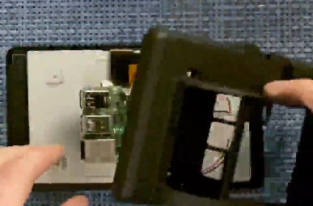
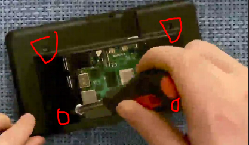
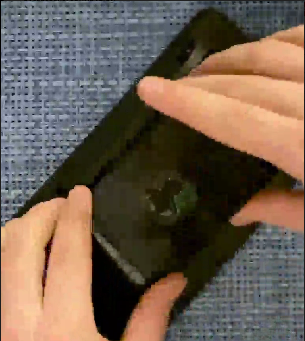

3. Finally, the pc is ready. Now we will leave it on the side until we set up the Operationg System.

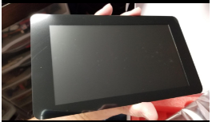 
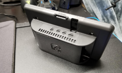

---
## Setup Operating System
First, this step might vary depending on the pi kit you bought so u might need to follow the instructions that comes with the kit. In this step you need your desktop pc with internet connection (I will use windows OS in this case since I know that not every one is familiar with or having a linux OS).
1. open any browser. We will download the the Imager program to flash the SD card with kali linux.
    
    * we will download the Win32 Diskimager from [here](https://sourceforge.net/projects/win32diskimager/). When the download finish you will see the file in the downloads 

     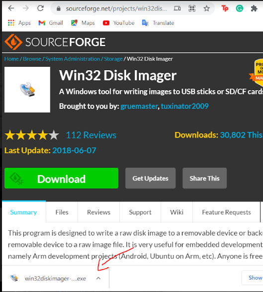

    * After downloading the imager we will download (kali linux image). you can download it from [here](https://www.offensive-security.com/kali-linux-arm-images/). when you go to this web site we will chose the image for our computer. Since we are using a raspberry pi 4 we are going to chose RASPBERRYPI FOUNDATION then download the file that fits our pi witch is kali linux RPI 2,3,4,400 (64-Bit) img.xz. then decompress it 
    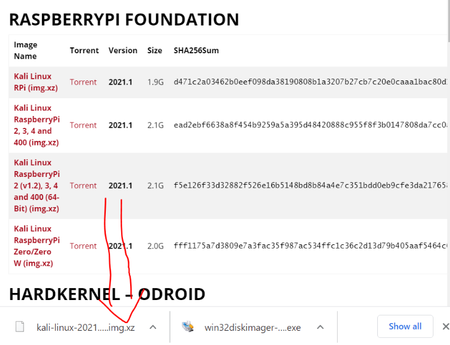

    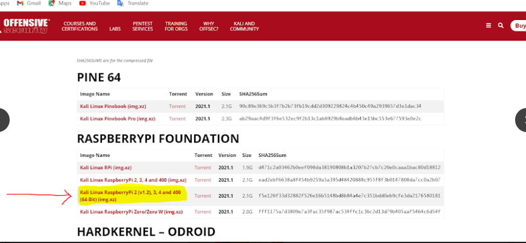

2. second open your downloads folder you will find the two files. Open Win32diskimagerinstall.exe but you need to run it as a administrator by clicking the right click on the mouse > run as administrator > yes
 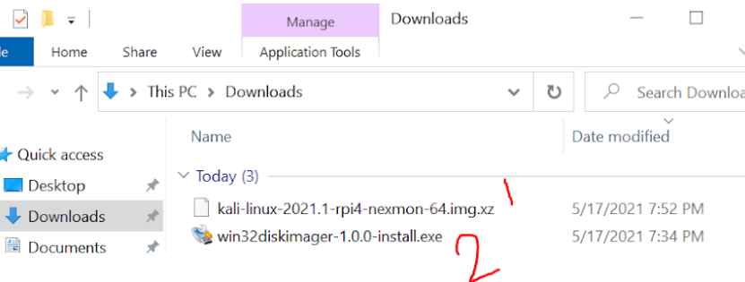

   * you will see this screen.

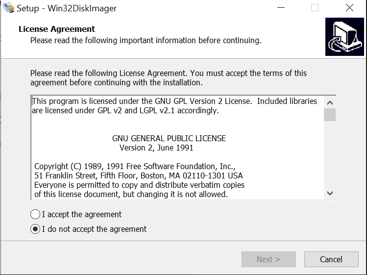

*  click on Iaccept the agreement > next 

*  here you will those the location to install the program in. You can hit BROWSE and chose the target file or just keep it as is click next >

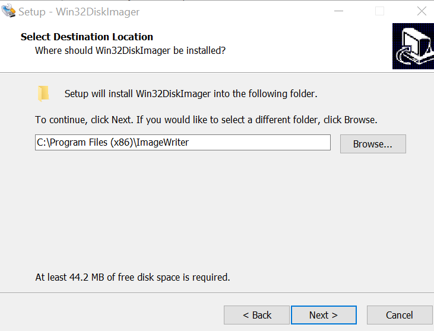
    
    
    
* if you want to create a desktop shortcut click the square if don't just do next.

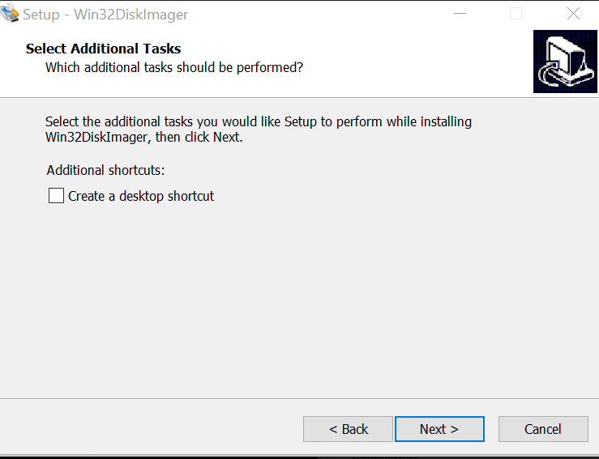

* then click install > finish. Now you will see this screen 

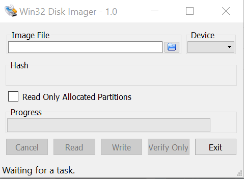

* now we will chose the kali linux img and flash it into the sd card. click on browse 

     then go to downloads and select the kali linux image file that we decompressed before then connect your SD card via the adapter to the pc. If your SD card isn’t automatically detected by the application, click on the drop-down menu at the top right (labeled “Device”) and choose it from the list.

     finally click on WRITE and wait for Win32DiskImager to do its thing. When it finishes, you can safely eject your SD card and insert it into your Raspberry Pi.

---

## Plug Everything In and Power On

With the display attached, it’s time to plug everything else in. 
  1. put the SD card in the SD card slot in the raspberry pi.
  2. connect the HDMI cable to the pi and the screen.
  3. plug in the USB for the mini keyboard which you will find in the back of the keyboard.
  4. place the power bank or you can glue it to the back of the screen and connect the power cables the micro usb card to the screen and the type C cable to the pi.

now the startup can be kind of slow and clunky but don't worry it's just for the first time.

## Finally 
After booting up this screen will pop up. in case that you need to enter a user and a password. the user is root and the password is toor

after a while you will have the boot menu click on graphical install

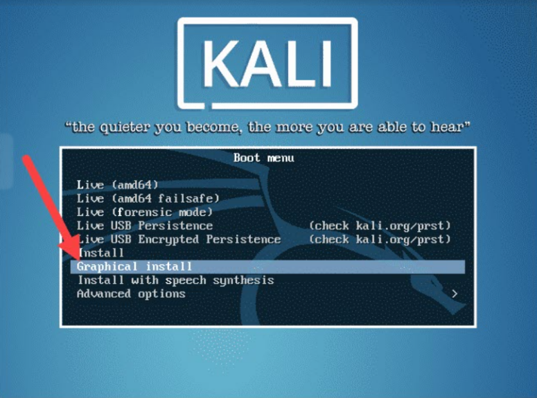
1. select language 
2. select your location 
3. configure the keyboard and the network 
4. set up user and password (create a strong root password)
5. configure the clock 
6. Partition disks (Select how you would like to partition the hard disk).
7. Next, select the scheme for partitioning. If you are a new user, go for All files in one partition.
8. Configure the package manager. 

 Congrats, the interface of kali linux appears on the screen 

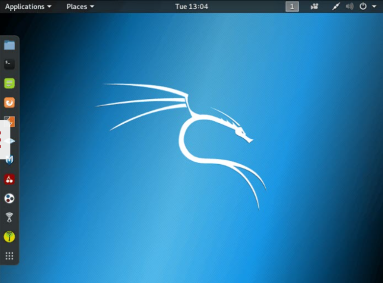

 ---
## Conclusion 
By following this project you have created a mini hacking computer which helps in many situations, use it in a good ways starting with penetration testing to security testing.

---
## Take This Project Further
Actually I was thinking about something that would be great adding it to this project, which is solar panels. Installing a small solar panel to the computer makes it charging the battery by it self. In case that I find a good panel giving high power and charging the power bank is amazing since nothing will stop you of doing something. You have a computer that can hack into almost anything working on a battery and solar system, you can use it any where where is has sun and by night working threw the battery. You will have incredible power.

---
cis 106 spring semester 
pccc 
Jood M.
professor R.alberto 

  

