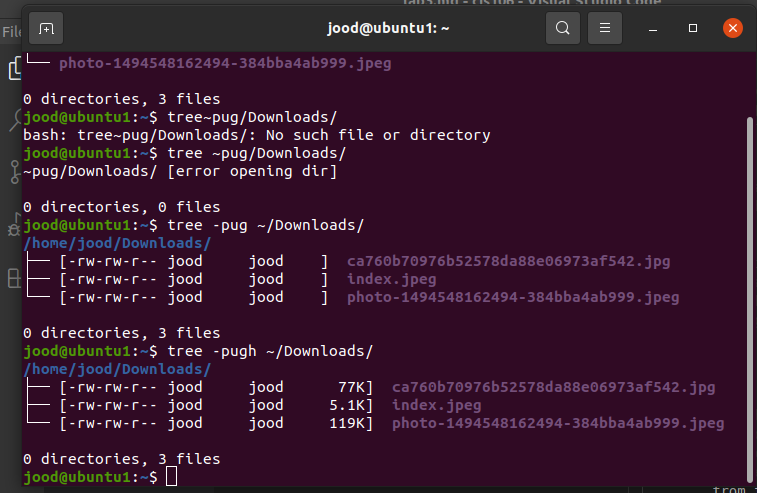
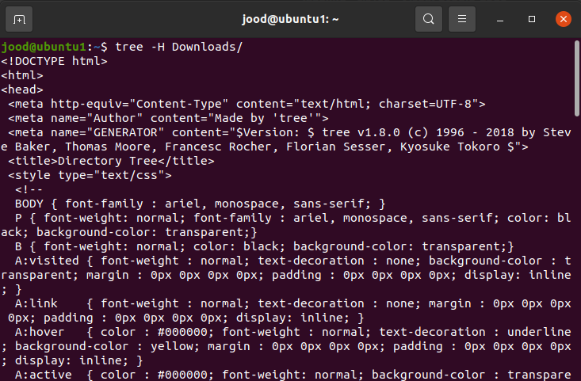
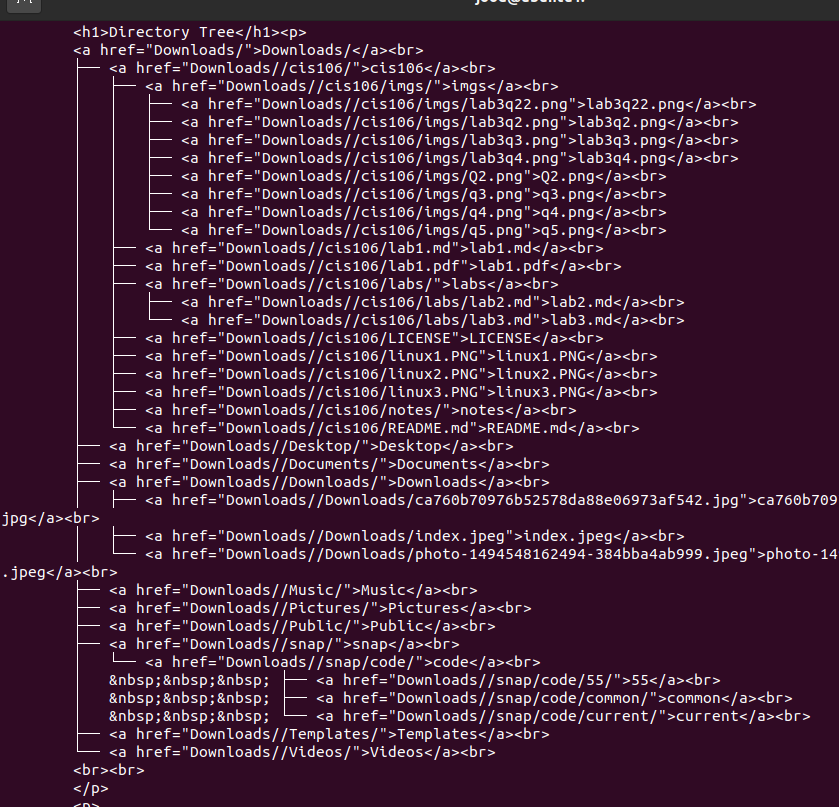
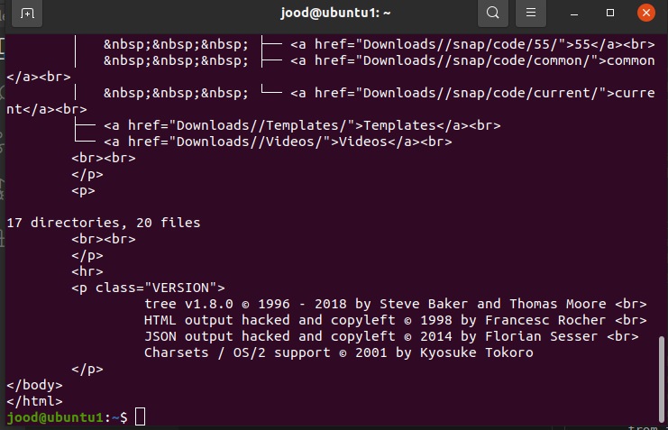
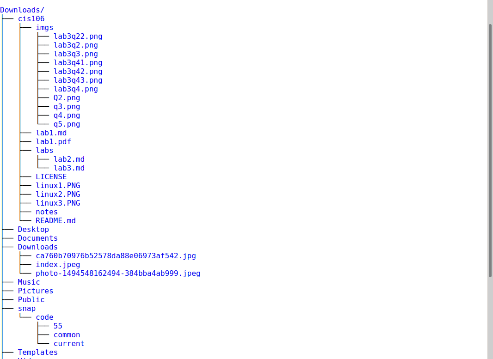
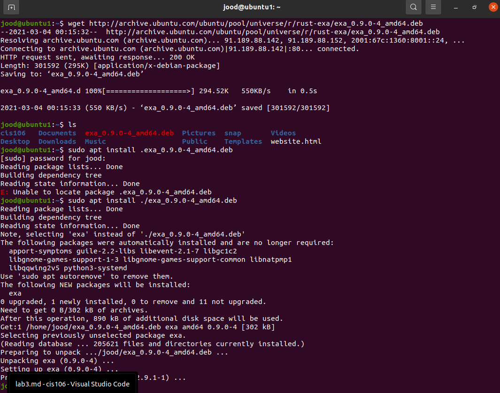
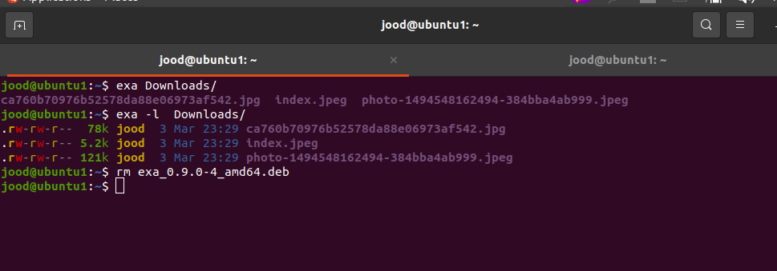
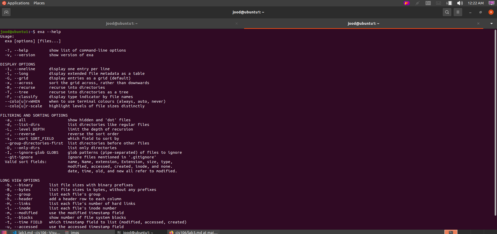

# Lab 3 | Installing software and navigating the file system | Answers
Assignment description [here](https://raw.githubusercontent.com/ra559/cis106/main/labs/lab3.md)

## Question 1
1. Which command did you use to search for the themes and to install them? 
2. 

sudo apt install zsh-theme-powerlevel9k

4. Which commands did you use to find and install the web browser?
3.1 What is the name of the package? 

 sudo apt install xfce4-dict

3.2 What dependencies are needed in order to install the package? (you can either take a screenshot of the terminal or copy and paste from the terminal)

 libxfce4panel-2.0-4 libxfce4ui-2-0 libxfce4ui-common
  libxfce4util-bin libxfce4util-common libxfce4util7
  libxfconf-0-3 xfconf

3.3 How much disk space will the package utilize after installation?
 
 4,398 kB of additional disk space will be used.

## Question 2

   

## Question 3

## Question 4

## Question 5
  
 
 

