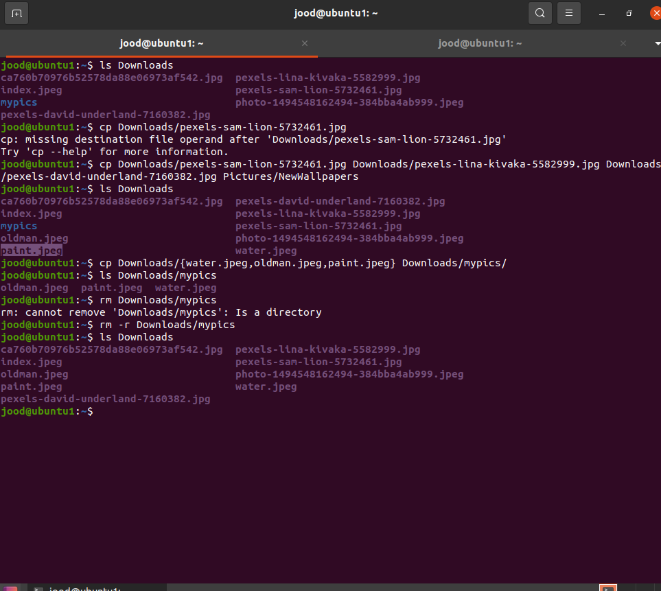

Lab 4 | Managing files and directories
IMPORTANT - READ ME
Lab video here

You have to complete labs 0, 1, 2, and 3 before attempting lab 4.
If you are using the Cloud environment (Apporto), Make sure that you have complete the Setup per this video before doing this lab.
Managing files and directories
All the questions in this lab will be in your midterm.
Questions 1 - 4 are worth 25 points
Questions 5 does not require a submission.

Question 1: Creating Files and Directories
Create a Directory in YOUR home directory labeled: lab4. Change your current working directory to ~/lab4.
Create 3 directories: pets,docs,songs. Inside each directory, create 2 subdirectories called: new and old.
Inside the new and old directories, create 3 files: file1, file2, and file3.
list the lab4 directory recursively.
Use the tree command to list the lab4 directory.
Take a screenshot of the terminal only. Your screenshot must show all the commands that you used to answer questions 1-5. Multiple screenshots is allowed

Question 2: Removing Files and Directories
Change your current working directory to: /srv/
Remove the file1, file2, file3 files inside the labs/pets/new/ directory without changing your current working directory.
Remove the pets directory without changing your current working directory.
Remove the docs and songs directories without changing your current working directory.
Remove the lab4 directory without changing your current working directory.
Take a screenshot of the terminal only. Your screenshot must show all the commands that you used to answer questions 1-5. Multiple screenshots is allowed

Question 3: Moving Files and Directories
Make sure that you are working on your home directory. Run the following command: wget https://robertalberto.com/public/lab4.zip && unzip lab4.zip && rm lab4.zip
In your home directory, create the following directories: lab4-imgs, lab4-audio, lab4-video, lab4-docs
Move all the files inside the lab4 directory to their respective new directories in your home directory.
Inside the lab4 directory, you will find a directory called Wallpaperlab4. Move this directory to your Pictures directory and rename it to NewWallpapers.
Rename the lab4 directory to Lab-4.
Take a screenshot of the terminal only. Your screenshot must show all the commands that you used to answer questions 1-5. Multiple screenshots is allowed

Question 4: Copying Files and Directories
Go to pexels.com. Download at least 3 wallpapers.
Copy the wallpapers to your Pictures/NewWallpapers directory.
Create a new directory in your Downloads directory (use whatever naming convention you want). Download 3 wallpapers and move them to your new directory.
Copy your new directory to the Pictures directory.
Remove the new directory in your Downloads directory.
Take a screenshot of the terminal only. Your screenshot must show all the commands that you used to answer questions 1-5. Multiple screenshots is allowed

Question 5: Getting Help
This part of this question requires no screenshot! It is just to practice the man command. You can use the less pager commands to move around the man page:

Less pager commands
From the book on page: 19.

Open the man page of the ls command.
Open the help page of the man page. Read it!
Make sure that you learn how to Quit and Move around.
