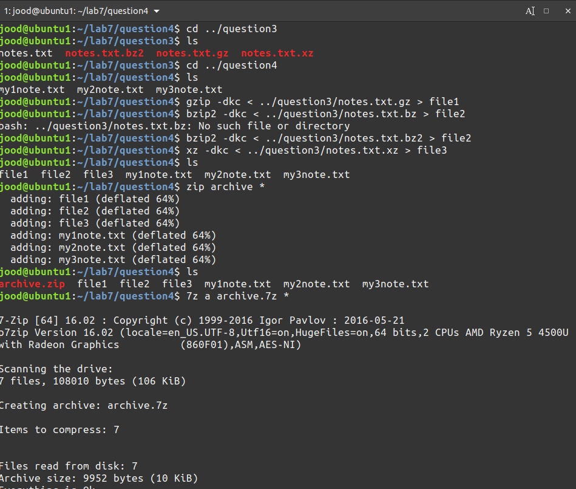

## lab 7 

# Q1

# Q2

# Q3

# Q4

1. in question 3&4 i used a ls -lh because it was the simple way to get a long list but I watched the video and I saw that you said it already at the end 

2. since the 7z app doesnt create rar archive I tried to install rar and do it but it didnt work  