## FINAL NOTES CIS 106

**table of content**
-[NOTE#1](notes#1.md)
-[NOTE#2](notes#2.md)
-[NOTE#3](notes#3.md)
-[NOTE#4](notes#4.md)
-[NOTE#5](notes#5.md)
-[NOTE#6](notes#6.md)

# notes #1
# What is Linux?
=======
# notes#1
## What is Linux?
>>>>>>> 5554b17e275f71e61cdfa70f226465f9a98f1514

 its one of the most popular platforms on the planet and its a family of open-source Unix-like operating systems based on the Linux kernel,an operating system kernel first released on September 17, 1991, by Linus Torvalds. Linux is typically packaged in a Linux distribution.

## What is a Linux Distribution?

distribution (often abbreviated as distro) is an operating system made from a software collection that is based upon the Linux kernel. There are two main Linux distros that branch out alot of distros:
1: debian.
2: redhat.

also there is a great website that allows to try the distributions before installing them called distrotest.
link (https://distrotest.net/index.php)

## The History of GNU/Linux

GNU stands for "GNU's Not Unix". It is pronounced as one syllable with a hard g. The word "free" in "free software" pertains to freedom, not price. Once you have the software, you have four specific freedoms in using it. You may or may not pay a price to get free software. Programmers are free to cooperate with each other, and often did in the 1970s. Richard Stallman started his career at MIT in 1971 in a group which used free software exclusively. The project was conceived in 1983 as a way of bringing back the cooperative spirit that prevailed in the computing community in earlier days, Stallman says. It was necessary to have a free operating system, he says, because if there was no free system, users would have to resort to proprietary software. 

## Open Source Vs Closed Source Vs Free Software

|Open Source      | Closed Source      | Free Software     |
| --- | ---| --
|  the software and the code can be distrbuted for free or a fee but must have the source code with the software .  |the software is not distributed with the source code and the user is restricted from modifing the code. |  the software is distributed with the source code. the software can for free or obtained by a fee.   |

## What is Ubuntu?

<<<<<<< HEAD
Ubuntu is a linux distro based on debian and composed mostly of free and open-source software. Ubuntu is officially released in three editions: Desktop,     Server, and Core for Internet of things devices and robots. All the editions can run on the computer alone, or in a virtual machine. Ubuntu is a popular operating system for cloud computing, with support for OpenStack. Ubuntu's default desktop has been GNOME, since version 17.10.

=======
Ubuntu is a linux distro based on debian and composed mostly of free and open-source software. Ubuntu is officially released in three editions: Desktop,     Server, and Core for Internet of things devices and robots. All the editions can run on the computer alone, or in a virtual machine. Ubuntu is a popular operating system for cloud computing, with support for OpenStack. Ubuntu's default desktop has been GNOME, since version 17.10 
>>>>>>> 5554b17e275f71e61cdfa70f226465f9a98f1514

Ubuntu logo and desktop:

<<<<<<< HEAD

=======

>>>>>>> 5554b17e275f71e61cdfa70f226465f9a98f1514

---

# Notes#2 

## What Is Virtualization?

its a replication of hardware to simulate a virtual machine inside a physical machine, and there is two main types of virtualization. 

* server-side virtualization 
* client-side virtualization
  * for client-side virtualization 

  computer needs: 
  1- A Hypervisor (software that allows the management of virtual machines).
  2- Hardware support (capable CPU, Enough RAM, Enough storage)

## Using Virtual Box 
 VB It's a powerful type 2 virtualization product for enterprise as well as home use. Also its an open source software under the gpl version 2. 
* Runs on 
   * windows 
   * linux
   * macintosh
   * solaris 
supports a large number of guest operating systems 

* The pc can virtualize but it need to meet these minimal specifications:-
   * AMD V or INTEL V compatible processor.
   * Dual core x64 processor with 1.3 GHz or faster 
   * 4 GB of RAM 
   * Enough free hard drive space for installing guest OSs 
  

INSTALLING VB 
to download VB just visit this link (https://www.virtualbox.org/wiki/Downloads). 

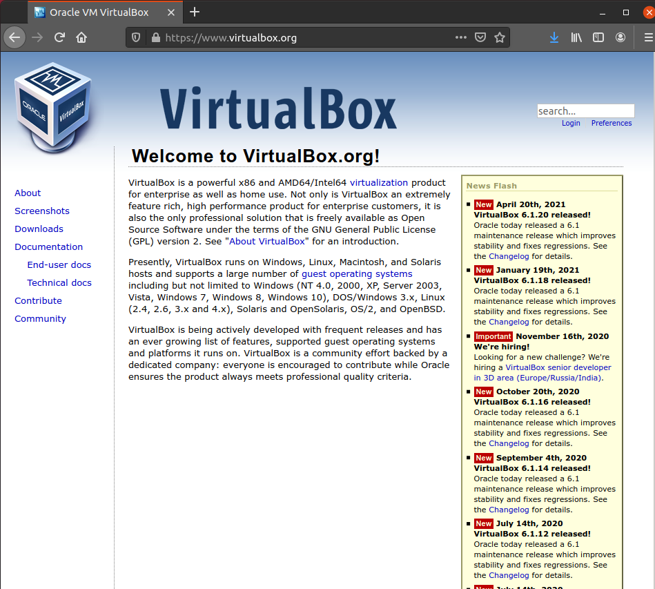

## Installing ubuntu 20.04 in VM with VB

 * First you need to install a oracle virtual box 
  
 * second go to ubuntu desktop download page (https://ubuntu.com/download/desktop) 
  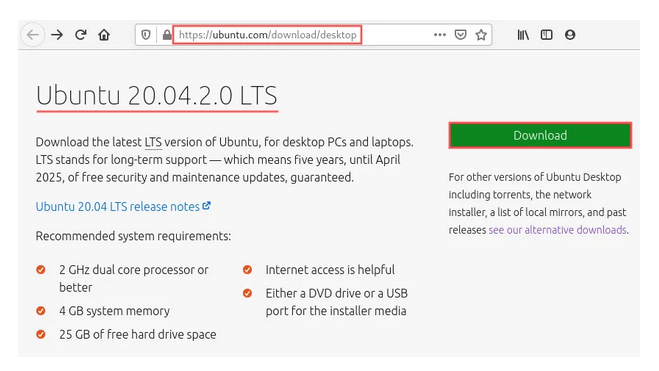
 * download the ubuntu desktop 20.04 iso image 

 * create a new virtual machine in virtual box by select Machine → New… from the program menu. After creating the new machine you need to set up your virtual machine, this is the most recommend settings to create a ubuntu machine with best performance --->

* FIRST. 
  name and operating system: 
The Create Virtual Machine dialog appears, asking you to enter the name for your virtual machine. This can be anything you like. After exploiting all my creative energy, I came up with the perfect name: UbuntuVM. Once you entered the name, make sure the Type selection box shows Linux and the Version selection box shows Ubuntu (64-bit).
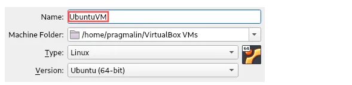
 
then press next-->

* SECOND.
 memory size: On this screen you can configure how much of the PC’s physical RAM your virtual machine can use. For an Ubuntu desktop installation, you should ideally select at least 4 GB, so 4096 MB. In any case, I recommend selecting no more than 50% of your PC’s physical RAM.

then press next-->

  * FINALLY.
   hard disk: select the type of hard disk for the virtual machine. Accept the default setting Create a virtual hard disk now and click the Create button. as next step VDI is the native virtual hard disk type for VirtualBox, so I recommend sticking with that one then you arrive at the screen where you can select how VirtualBox stores the virtual hard disk on your PC. The default of Dynamically allocated works fine. finally on the last screen you can select the name and location of the virtual hard disk file. I typically accept the default name and location for this, but feel free to change it. More importantly, you can select the maximum size of the virtual hard disk on this screen. The default proposed 10 GB suffices to install Ubuntu Desktop. But over time you probably will need more space to install applications so it might get tight so I recommend increasing the space to 30 GB. 

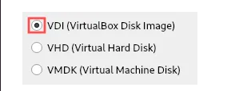
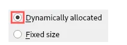

after complete all these steps click create. 

#### now you have setup the ubuntu machine but lets fine-tune our machine settings ->

 1. increase the number of the CPUs.

By default the virtual machine only makes use of one processor core of your PC’s physical CPU. Nowadays, most PCs offer at least a duo-core CPU. To give the virtual machine a bit more performance, I recommend increasing the CPU number to at least two. I recommend selecting no more than half of your PC’s physical CPU cores. So stay within the recommended green zone:

  2. improve graphics performance.

By far the most limiting feature of a virtual machine is its graphics performance. Unlike the CPU and RAM, it cannot directly access your PC’s graphics card. Instead, your virtual machine runs on top of a software emulated graphics card. Consequently, virtual machines are not capable of running high-end games or doing intensive 3D modeling. Everything else works pretty much okay though.

 3. insert the ubuntu iso image into optical disk drive.

From a virtual machine configuration perspective, only one last step remains: We need to virtually insert the previously downloaded Ubuntu ISO image into its optical disk drive. Go to the Storage category on the Settings dialog. Select the Empty storage device to show the optical drive attributes. Click the small blue disk icon. A drop down menu appears. Select Choose a disk file… from this menu:

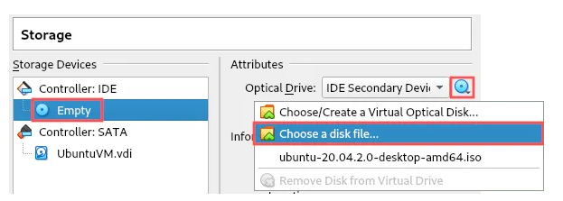

A file selection dialog shows up. Browse to the download directory of the Ubuntu ISO image and select this file:

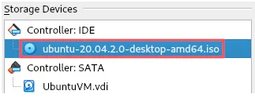

 This completes the final configuration of the virtual machine itself. Click OK at the bottom of the Settings dialog to save our changes.  

sources. 
medium.com/
wikipedia.org/
ubuntu.com/
oracle.com/

---

# notes#3

## Exploring Desktop Environments

In computing, a desktop environment (DE) is an implementation of the desktop metaphor made of a bundle of programs running on top of a computer operating system that share a common graphical user interface (GUI), sometimes described as a graphical shell. The desktop environment was seen mostly on personal computers until the rise of mobile computing. Desktop GUIs help the user to easily access and edit files, while they usually do not provide access to all of the features found in the underlying operating system. Instead, the traditional command-line interface (CLI) is still used when full control over the operating system is required.

**There are many graphical desktops**
the most 3 popular are 
* GNOME Desktop
  
* KDE Desktop
  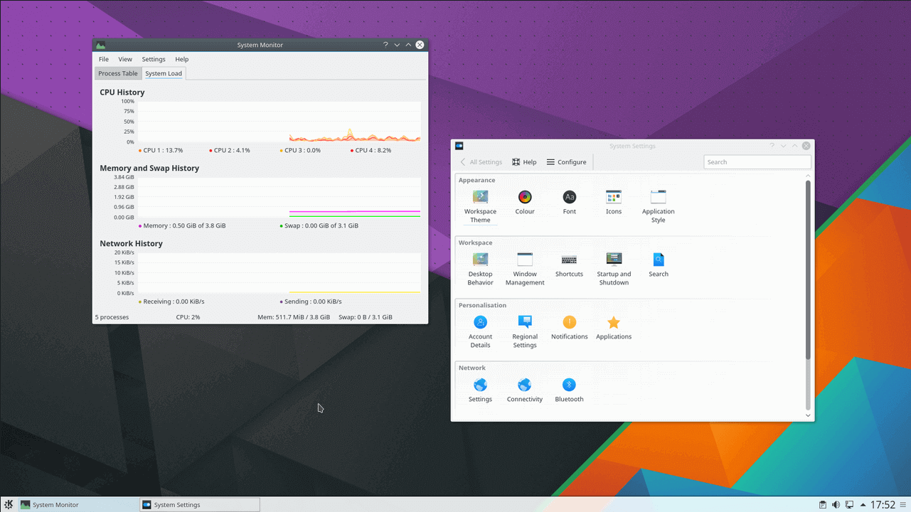
* Cinnamon Desktop
  

## What Is The Shell
shell is a computer program which exposes an operating system's services to a human user or other program. In general, operating system shells use either a command-line interface (CLI) or graphical user interface (GUI), depending on a computer's role and particular operation. It is named a shell because it is the outermost layer around the operating system

**what is a CLI**
CLI a Command-Line Interface is a means of interacting with a computer program where the user issues commands to the program in the form of successive lines os texts.

there are 2 ways to access the CLI
* Treminal Emulator 
* Linux Console

First, Treminal Emulator: The terminal is a program that provides the user with a simple command-line interface and performs the following 2 tasks:

1. Takes input from the user in the form of commands
2. Displays output on the screen
 
 We can say the terminal is a dumb thing so it does not know what to do with the input, so it needs another program to process it, and in most cases, it’s the Shell.

 
 

 Second, linux console:  the “Console” performs the same operations performed by the terminal

 

 ## Managing Software 
 Basic Treminology
  
* package: archives that binaries of software, configuration files, and information about dependencies. 
* Library : reusable code that can be used by more tan one function or program.
* Dependency: software needed as a foundation for other software 
* Repository: a large collection of software available to download
* APT is a set of tools for managing Debian Packages
* SNAPCRAFT snaps are app packages for desktop.
* Flatpak is a next generation technology for packaging distributing and managing software in Linux.

## Linux Filesystem
filesystem: its the way files are sorted and organized to simplify access to data.
 there are 3 file systems 
 1. The Nemo file manager  
 2. The Gnome file manager
 3. The Thunar file manager
   
the file system has 2 paths 
An absolute path contains the full address of the file location to refer to a certain directory in the computer, whereas the current directory is taken as reference to locate another directory in case of a relative path. A relative path contains a partial address of the absolute path based on its relation with the directory to which it’s linked.

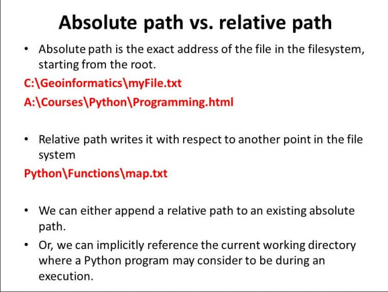

---

# Notes#4
MANAGING FILES AND DIRECTORIES

## Commands are often followed by an option that modify/enhance them.

 ex 
 ls -l (dir name)
where ls is the command
-l is the option followed by the dir name
---

command |usage|example|
---|---|---
mkdir | creating directories| mkdir (my tax)
touch|create files|touch file one
rm|removing files|rm file 1
mv|moving files | mv song one ~/Downloads
cp|coping files|cp song.mp3 ~/songs

---
## getting help 
man command
man (manual)  is a form of software documentation usually found on a Unix or Unix-like operating system. Topics covered include computer programs (including library and system calls), formal standards and conventions, and even abstract concepts. A user may invoke a man page by issuing the man command.

By default, man typically uses a terminal pager program such as more or less to display its output.

Man-pages are often referred to as an on-line or online form of software documentation,[1] even though the man command does not require internet access, dating back to the times when printed out-of-band manuals were the norm.

and to run the the MAN command you just need to provide it with the command you need help with for example 

man ls
it will show you this and to navigate inside the page you use the arrows and to quit press [q]

---
## WILD CARDS
Wildcards (also referred to as meta characters) are symbols or special characters that represent other characters. You can use them with any command such as ls command or rm command to list or remove files matching a given criteria, receptively.

1. An asterisk (*) – matches one or more occurrences of any character, including no character.
2. Question ma*rk (?) – represents or matches a single occurrence of any character.
3. Bracketed characters ([ ]) – matches any occurrence of character enclosed in the square brackets. It is possible to use different types of characters (alphanumeric characters): numbers, letters, other special characters etc.

for example 
This command will match all filenames prefixed with any two characters followed by st but ending with one or more occurrence of any character.

**{$ ls}**

**{$ ls ??st*}*

---

# NOTE#5
THE BASICS OF NANO AND VIM

## VIM
Vim, an acronym for Vi Improved, was released in 1991 as an improved project of vi, an older, screen-oriented text editor of originally developed for the Unix operating system. Vim is designed to be extremely versatile and fast, like its predecessor, Vi. On most Linux systems, Vim comes pre-installed and virtually available for all types of operating systems. Vim is available everywhere, therefore it really pays off to learn the basics to edit a text file with this text editor.

upon opening Vim, the Vim text editor interface shows on your system.

## NANO
The GNU nano, commonly known as ‘nano,’ is an improved project of the Pico text editor, which was released in 1999. Like Vim, Nano also comes pre-installed on most Linux systems. The Nano text editor an ideal tool for beginners. 

On startup, the Nano text editor shows the following interface.

## Important Features
To differentiate between these text editors, it would help to list some important features of Vim and Nano.

Using Vim, you can unlock speed and efficiency with some powerful features, which include window support, macros, command repetition, text objects, registers, filters, auto-completion, and global substitution.

Nano does not support advanced features, such as window splitting, macros, auto-completion, viewing multiple files at once, rectangle selecting/vertical block/editing, etc.

Vim is a more powerful tool with which you can make complicated edits in a quick and easy way. With Nano, it can prove more difficult and time-consuming to make complicated edits.

---

# NOTES#6

## MANAGING DATA

1. Backup: Copies files and directories to an archive 
2. System Backup : Use to restore data in case of a system failure or data loss.
3. Archive: File containing many other files, each of which is still identified by filename, owner , permissions and timestamp.
4. Tar: a program that create one file archives multiple files and directories.
5. CPIO: a program that  Creates an archive, restores files or copies a directory.
6. Ar: a program that  creates, modifies and extracts from archives.

## examples and usage for tar

## CPIO EXAMPLE 
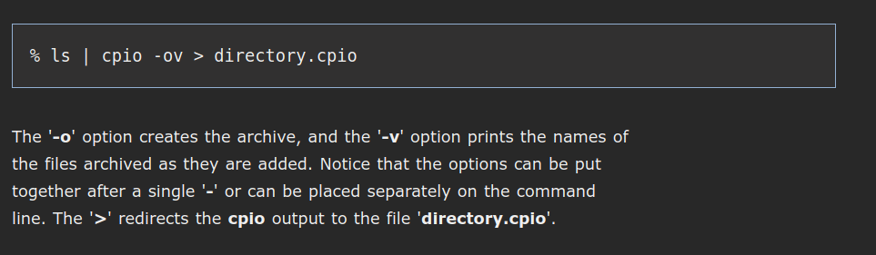

## AR 

## FILE COMPRESSION 
File Compression Originally, Unix file compression was handled by a utility called 'compress'. The gzip, bzip2, and xz commands are used for compression.

1. gzip ex and usage
   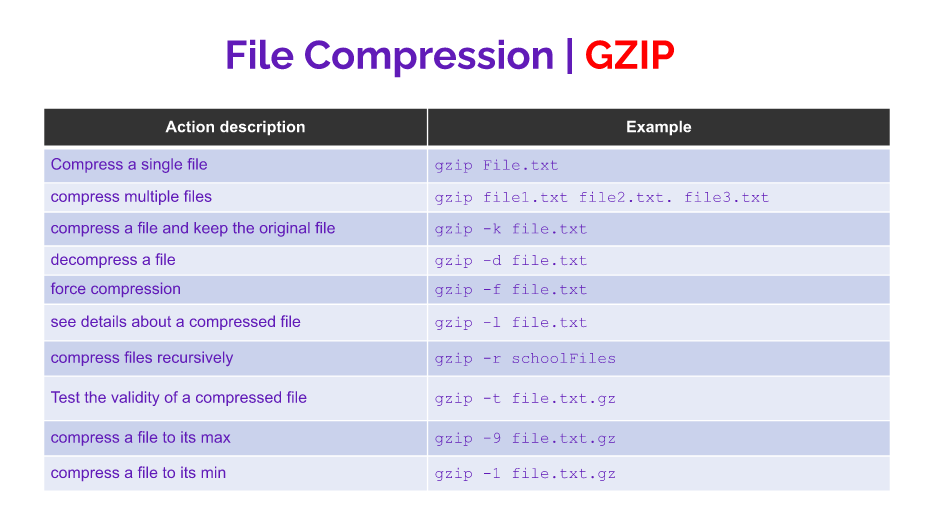

2. bzip2 ex and usage
 

3. xz ex and usage
   

## FILE PERMISSIONS

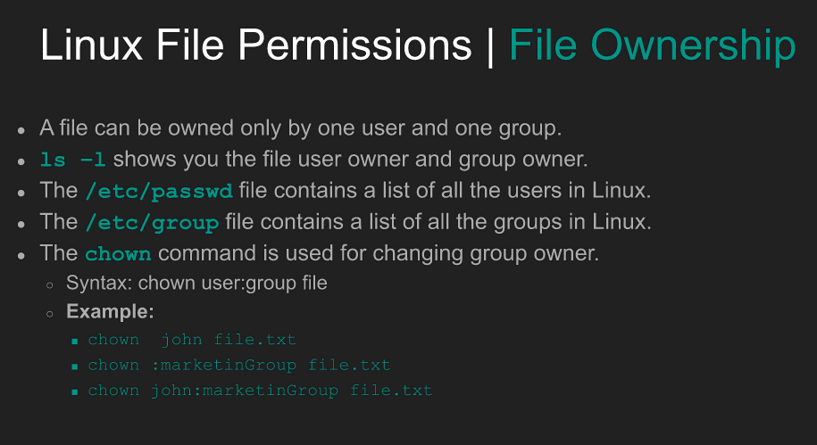
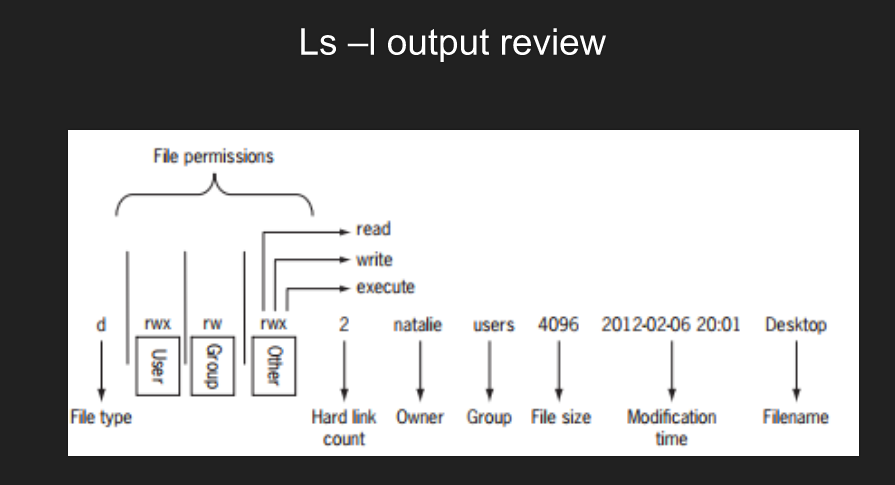 

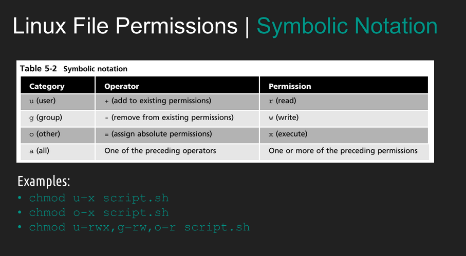

