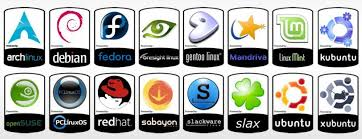
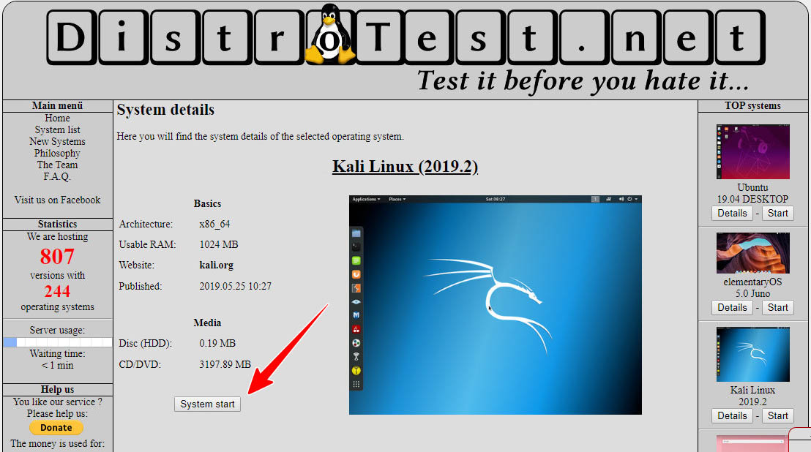
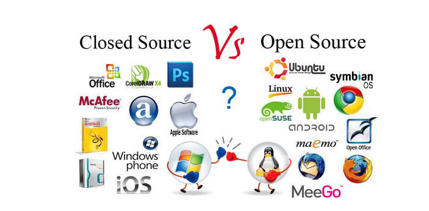
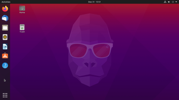

# notes#1
## What is Linux?

 its one of the most popular platforms on the planet and its a family of open-source Unix-like operating systems based on the Linux kernel,an operating system kernel first released on September 17, 1991, by Linus Torvalds. Linux is typically packaged in a Linux distribution.

## What is a Linux Distribution?

distribution (often abbreviated as distro) is an operating system made from a software collection that is based upon the Linux kernel. There are two main Linux distros that branch out alot of distros:
1: debian.
2: redhat.

also there is a great website that allows to try the distributions before installing them called distrotest.
link (https://distrotest.net/index.php)

## The History of GNU/Linux

GNU stands for "GNU's Not Unix". It is pronounced as one syllable with a hard g. The word "free" in "free software" pertains to freedom, not price. Once you have the software, you have four specific freedoms in using it. You may or may not pay a price to get free software. Programmers are free to cooperate with each other, and often did in the 1970s. Richard Stallman started his career at MIT in 1971 in a group which used free software exclusively. The project was conceived in 1983 as a way of bringing back the cooperative spirit that prevailed in the computing community in earlier days, Stallman says. It was necessary to have a free operating system, he says, because if there was no free system, users would have to resort to proprietary software. 

## Open Source Vs Closed Source Vs Free Software

|Open Source      | Closed Source      | Free Software     |
| --- | ---| --
|  the software and the code can be distrbuted for free or a fee but must have the source code with the software .  |the software is not distributed with the source code and the user is restricted from modifing the code. |  the software is distributed with the source code. the software can for free or obtained by a fee.   |

## What is Ubuntu?

Ubuntu is a linux distro based on debian and composed mostly of free and open-source software. Ubuntu is officially released in three editions: Desktop,     Server, and Core for Internet of things devices and robots. All the editions can run on the computer alone, or in a virtual machine. Ubuntu is a popular operating system for cloud computing, with support for OpenStack. Ubuntu's default desktop has been GNOME, since version 17.10 

Ubuntu logo and desktop:

