# Notes#2 

## What Is Virtualization?

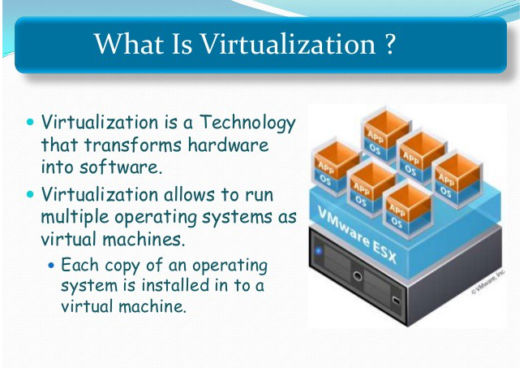
its a replication of hardware to simulate a virtual machine inside a physical machine, and there is two main types of virtualization. 

* server-side virtualization 
* client-side virtualization
  * for client-side virtualization 

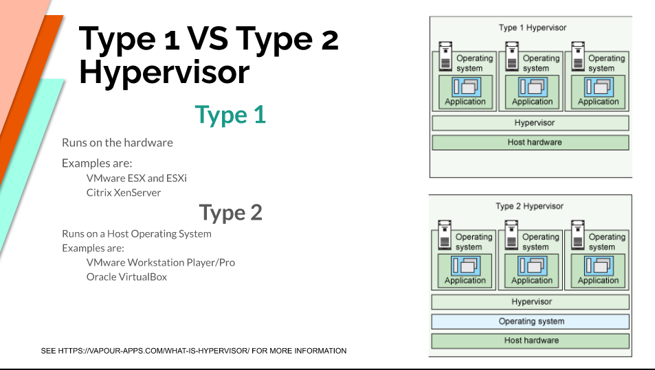
  computer needs: 
  1- A Hypervisor (software that allows the management of virtual machines).
  2- Hardware support (capable CPU, Enough RAM, Enough storage)

## Using Virtual Box 
 VB It's a powerful type 2 virtualization product for enterprise as well as home use. Also its an open source software under the gpl version 2. 
* Runs on 
   * windows 
   * linux
   * macintosh
   * solaris 
supports a large number of guest operating systems 

* The pc can virtualize but it need to meet these minimal specifications:-
   * AMD V or INTEL V compatible processor.
   * Dual core x64 processor with 1.3 GHz or faster 
   * 4 GB of RAM 
   * Enough free hard drive space for installing guest OSs 
  

INSTALLING VB 
to download VB just visit this link (https://www.virtualbox.org/wiki/Downloads). 

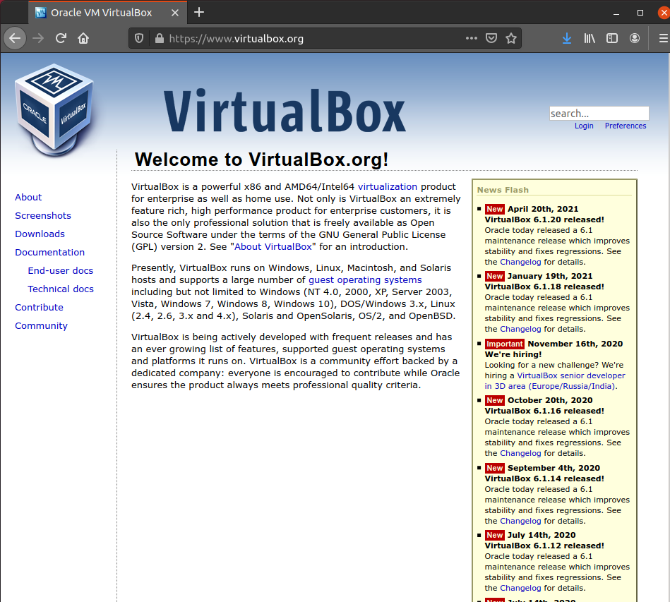

## Installing ubuntu 20.04 in VM with VB

 * First you need to install a oracle virtual box 
  
 * second go to ubuntu desktop download page (https://ubuntu.com/download/desktop) 
  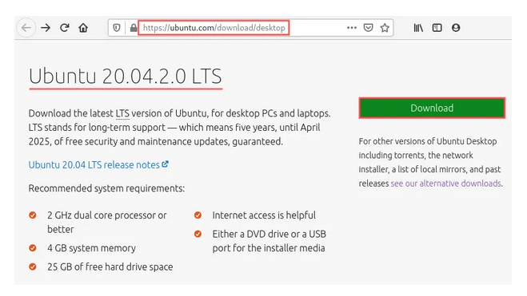
 * download the ubuntu desktop 20.04 iso image 

 * create a new virtual machine in virtual box by select Machine → New… from the program menu. After creating the new machine you need to set up your virtual machine, this is the most recommend settings to create a ubuntu machine with best performance --->

* FIRST. 
  name and operating system: 
The Create Virtual Machine dialog appears, asking you to enter the name for your virtual machine. This can be anything you like. After exploiting all my creative energy, I came up with the perfect name: UbuntuVM. Once you entered the name, make sure the Type selection box shows Linux and the Version selection box shows Ubuntu (64-bit).
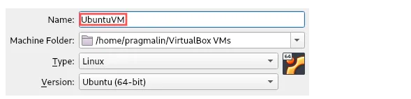
 
then press next-->

* SECOND.
 memory size: On this screen you can configure how much of the PC’s physical RAM your virtual machine can use. For an Ubuntu desktop installation, you should ideally select at least 4 GB, so 4096 MB. In any case, I recommend selecting no more than 50% of your PC’s physical RAM.

then press next-->

  * FINALLY.
   hard disk: select the type of hard disk for the virtual machine. Accept the default setting Create a virtual hard disk now and click the Create button. as next step VDI is the native virtual hard disk type for VirtualBox, so I recommend sticking with that one then you arrive at the screen where you can select how VirtualBox stores the virtual hard disk on your PC. The default of Dynamically allocated works fine. finally on the last screen you can select the name and location of the virtual hard disk file. I typically accept the default name and location for this, but feel free to change it. More importantly, you can select the maximum size of the virtual hard disk on this screen. The default proposed 10 GB suffices to install Ubuntu Desktop. But over time you probably will need more space to install applications so it might get tight so I recommend increasing the space to 30 GB. 

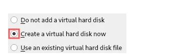
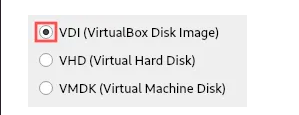
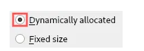

after complete all these steps click create. 

#### now you have setup the ubuntu machine but lets fine-tune our machine settings ->

 1. increase the number of the CPUs.

By default the virtual machine only makes use of one processor core of your PC’s physical CPU. Nowadays, most PCs offer at least a duo-core CPU. To give the virtual machine a bit more performance, I recommend increasing the CPU number to at least two. I recommend selecting no more than half of your PC’s physical CPU cores. So stay within the recommended green zone:

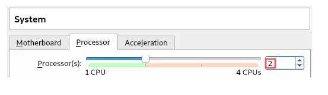

  2. improve graphics performance.

By far the most limiting feature of a virtual machine is its graphics performance. Unlike the CPU and RAM, it cannot directly access your PC’s graphics card. Instead, your virtual machine runs on top of a software emulated graphics card. Consequently, virtual machines are not capable of running high-end games or doing intensive 3D modeling. Everything else works pretty much okay though.

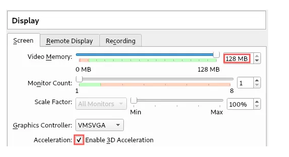

 3. insert the ubuntu iso image into optical disk drive.

From a virtual machine configuration perspective, only one last step remains: We need to virtually insert the previously downloaded Ubuntu ISO image into its optical disk drive. Go to the Storage category on the Settings dialog. Select the Empty storage device to show the optical drive attributes. Click the small blue disk icon. A drop down menu appears. Select Choose a disk file… from this menu:

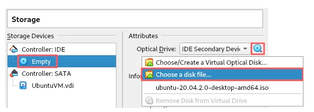

A file selection dialog shows up. Browse to the download directory of the Ubuntu ISO image and select this file:

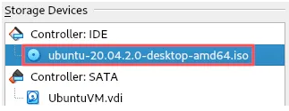

 This completes the final configuration of the virtual machine itself. Click OK at the bottom of the Settings dialog to save our changes.  

sources. 
medium.com/
wikipedia.org/
ubuntu.com/
oracle.com/
