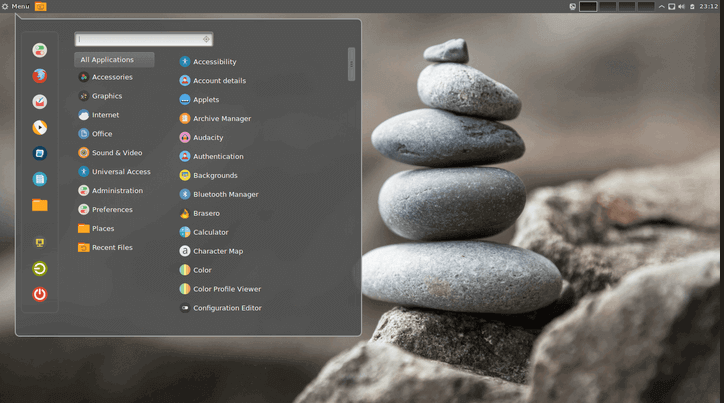

# notes#3

## Exploring Desktop Environments

In computing, a desktop environment (DE) is an implementation of the desktop metaphor made of a bundle of programs running on top of a computer operating system that share a common graphical user interface (GUI), sometimes described as a graphical shell. The desktop environment was seen mostly on personal computers until the rise of mobile computing. Desktop GUIs help the user to easily access and edit files, while they usually do not provide access to all of the features found in the underlying operating system. Instead, the traditional command-line interface (CLI) is still used when full control over the operating system is required.

**There are many graphical desktops**
the most 3 popular are 
* GNOME Desktop
  
* KDE Desktop
  
* Cinnamon Desktop
  

## What Is The Shell
shell is a computer program which exposes an operating system's services to a human user or other program. In general, operating system shells use either a command-line interface (CLI) or graphical user interface (GUI), depending on a computer's role and particular operation. It is named a shell because it is the outermost layer around the operating system

**what is a CLI**
CLI a Command-Line Interface is a means of interacting with a computer program where the user issues commands to the program in the form of successive lines os texts.

there are 2 ways to access the CLI
* Treminal Emulator 
* Linux Console

First, Treminal Emulator: The terminal is a program that provides the user with a simple command-line interface and performs the following 2 tasks:

1. Takes input from the user in the form of commands
2. Displays output on the screen
 
 We can say the terminal is a dumb thing so it does not know what to do with the input, so it needs another program to process it, and in most cases, it’s the Shell.

 
 

 Second, linux console:  the “Console” performs the same operations performed by the terminal

 

 ## Managing Software 
 Basic Treminology
  
* package: archives that binaries of software, configuration files, and information about dependencies. 
* Library : reusable code that can be used by more tan one function or program.
* Dependency: software needed as a foundation for other software 
* Repository: a large collection of software available to download
* APT is a set of tools for managing Debian Packages
* SNAPCRAFT snaps are app packages for desktop.
* Flatpak is a next generation technology for packaging distributing and managing software in Linux.

## Linux Filesystem
filesystem: its the way files are sorted and organized to simplify access to data.
 there are 3 file systems 
 1. The Nemo file manager  
 2. The Gnome file manager
 3. The Thunar file manager
   
the file system has 2 paths 
An absolute path contains the full address of the file location to refer to a certain directory in the computer, whereas the current directory is taken as reference to locate another directory in case of a relative path. A relative path contains a partial address of the absolute path based on its relation with the directory to which it’s linked.

