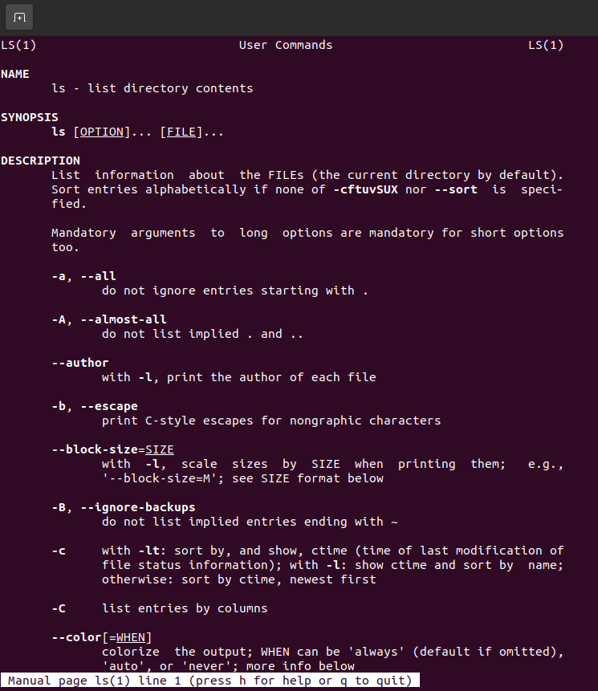
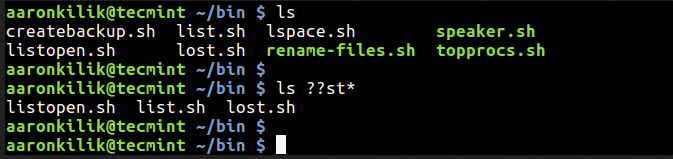

# Notes#4
MANAGING FILES AND DIRECTORIES

## Commands are often followed by an option that modify/enhance them.

 ex 
 ls -l (dir name)
where ls is the command
-l is the option followed by the dir name
---

command |usage|example|
---|---|---
mkdir | creating directories| mkdir (my tax)
touch|create files|touch file one
rm|removing files|rm file 1
mv|moving files | mv song one ~/Downloads
cp|coping files|cp song.mp3 ~/songs

---
## getting help 
man command
man (manual)  is a form of software documentation usually found on a Unix or Unix-like operating system. Topics covered include computer programs (including library and system calls), formal standards and conventions, and even abstract concepts. A user may invoke a man page by issuing the man command.

By default, man typically uses a terminal pager program such as more or less to display its output.

Man-pages are often referred to as an on-line or online form of software documentation,[1] even though the man command does not require internet access, dating back to the times when printed out-of-band manuals were the norm.

and to run the the MAN command you just need to provide it with the command you need help with for example 

man ls
it will show you this and to navigate inside the page you use the arrows and to quit press [q]

---
## WILD CARDS
Wildcards (also referred to as meta characters) are symbols or special characters that represent other characters. You can use them with any command such as ls command or rm command to list or remove files matching a given criteria, receptively.

1. An asterisk (*) – matches one or more occurrences of any character, including no character.
2. Question ma*rk (?) – represents or matches a single occurrence of any character.
3. Bracketed characters ([ ]) – matches any occurrence of character enclosed in the square brackets. It is possible to use different types of characters (alphanumeric characters): numbers, letters, other special characters etc.

for example 
This command will match all filenames prefixed with any two characters followed by st but ending with one or more occurrence of any character.

**{$ ls}**

**{$ ls ??st*}*

---

