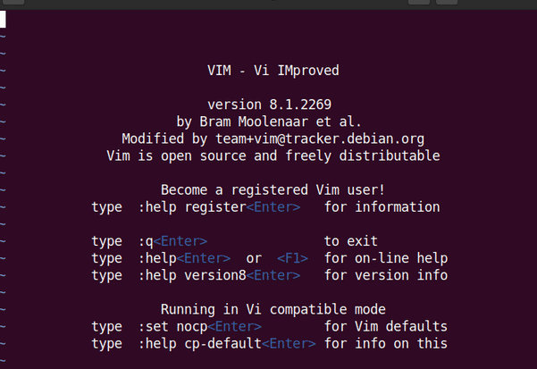
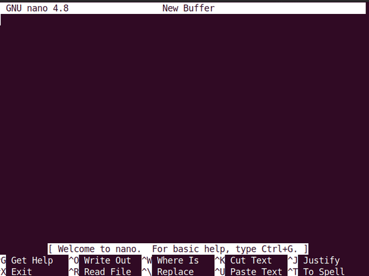

# NOTE#5
THE BASICS OF NANO AND VIM

## VIM
Vim, an acronym for Vi Improved, was released in 1991 as an improved project of vi, an older, screen-oriented text editor of originally developed for the Unix operating system. Vim is designed to be extremely versatile and fast, like its predecessor, Vi. On most Linux systems, Vim comes pre-installed and virtually available for all types of operating systems. Vim is available everywhere, therefore it really pays off to learn the basics to edit a text file with this text editor.

upon opening Vim, the Vim text editor interface shows on your system.

## NANO
The GNU nano, commonly known as ‘nano,’ is an improved project of the Pico text editor, which was released in 1999. Like Vim, Nano also comes pre-installed on most Linux systems. The Nano text editor an ideal tool for beginners. 

On startup, the Nano text editor shows the following interface.

## Important Features
To differentiate between these text editors, it would help to list some important features of Vim and Nano.

Using Vim, you can unlock speed and efficiency with some powerful features, which include window support, macros, command repetition, text objects, registers, filters, auto-completion, and global substitution.

Nano does not support advanced features, such as window splitting, macros, auto-completion, viewing multiple files at once, rectangle selecting/vertical block/editing, etc.

Vim is a more powerful tool with which you can make complicated edits in a quick and easy way. With Nano, it can prove more difficult and time-consuming to make complicated edits.