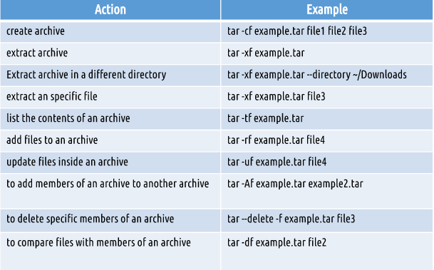
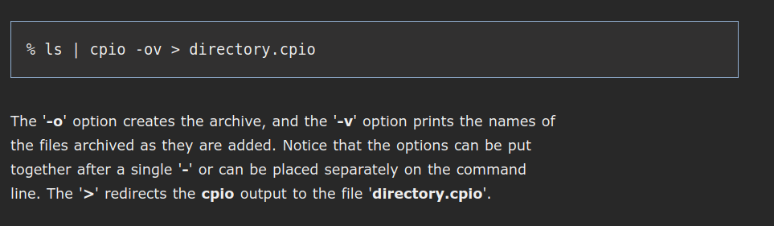
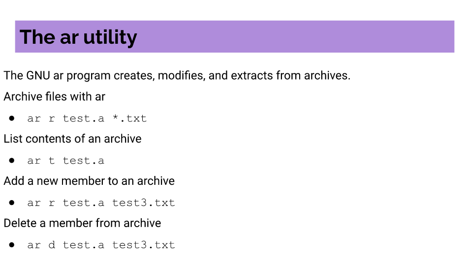
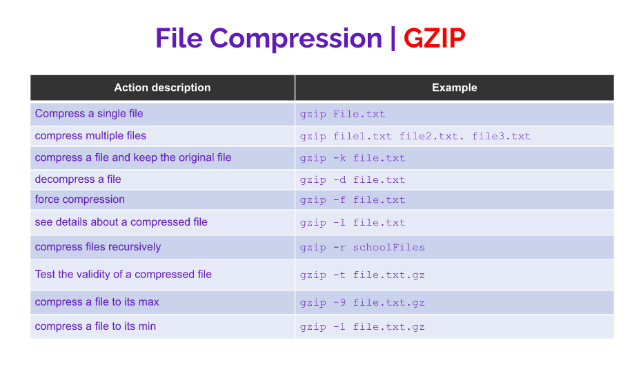
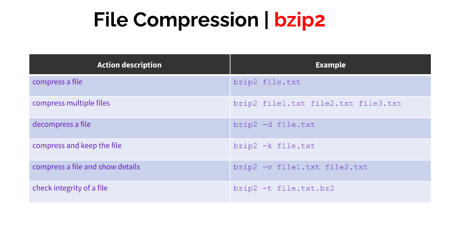
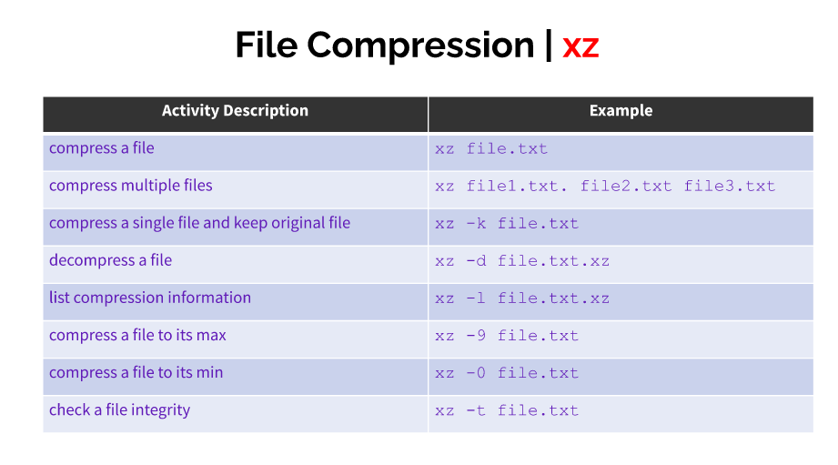
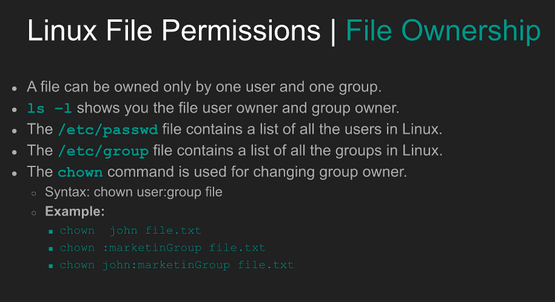
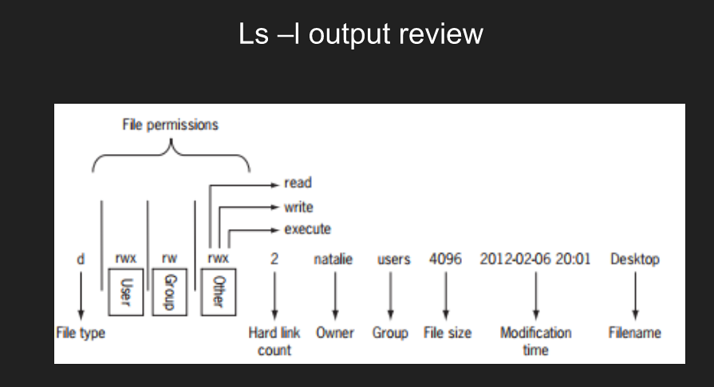
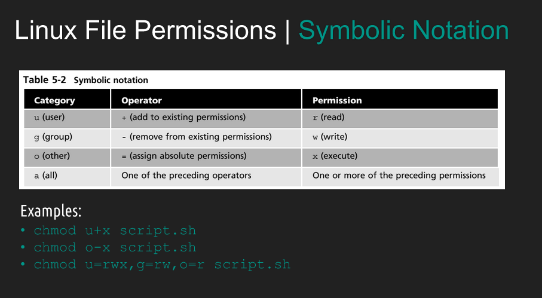
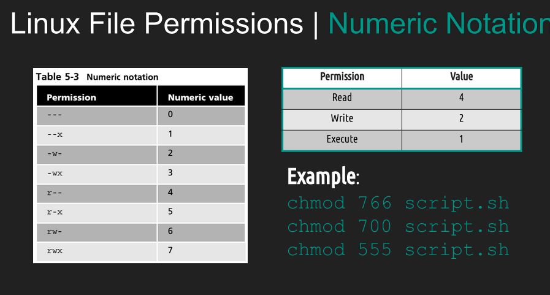

# NOTES#6

## MANAGING DATA

1. Backup: Copies files and directories to an archive 
2. System Backup : Use to restore data in case of a system failure or data loss.
3. Archive: File containing many other files, each of which is still identified by filename, owner , permissions and timestamp.
4. Tar: a program that create one file archives multiple files and directories.
5. CPIO: a program that  Creates an archive, restores files or copies a directory.
6. Ar: a program that  creates, modifies and extracts from archives.

## examples and usage for tar

## CPIO EXAMPLE 

## AR 

## FILE COMPRESSION 
File Compression Originally, Unix file compression was handled by a utility called 'compress'. The gzip, bzip2, and xz commands are used for compression.

1. gzip ex and usage
   

2. bzip2 ex and usage
 

3. xz ex and usage
   

## FILE PERMISSIONS

 

